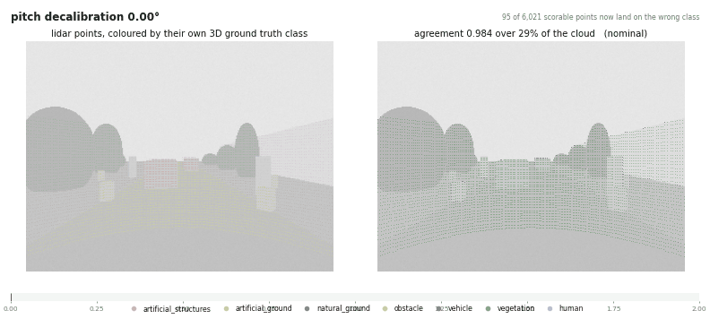
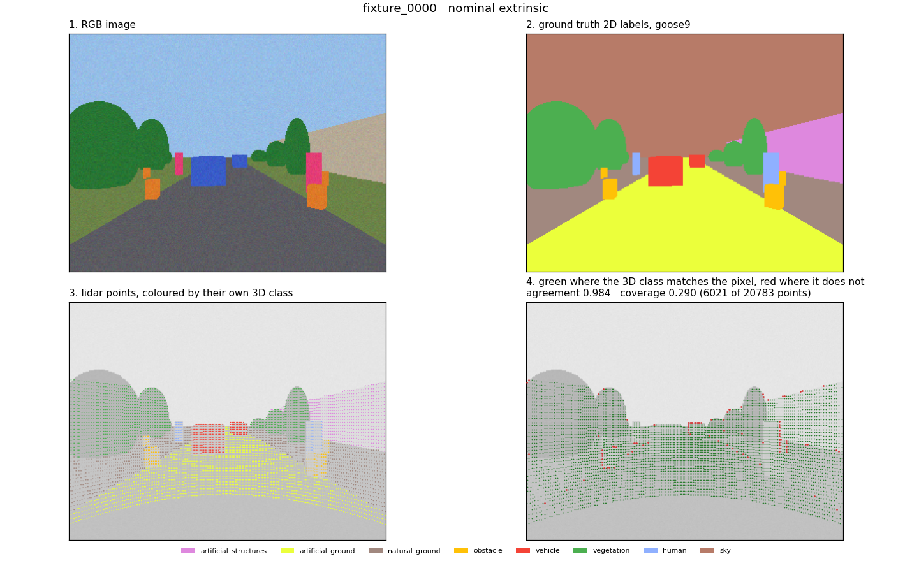
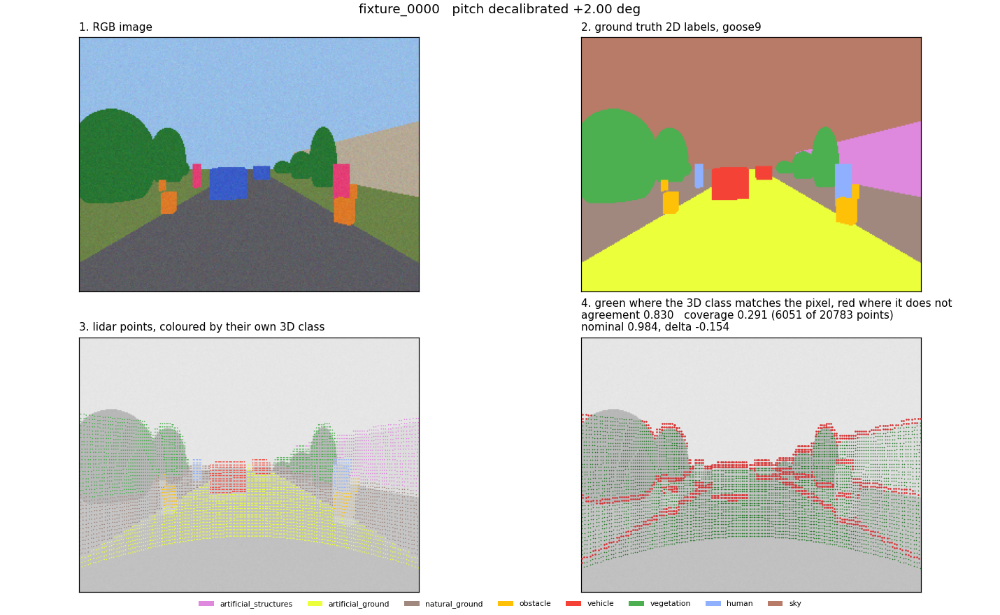
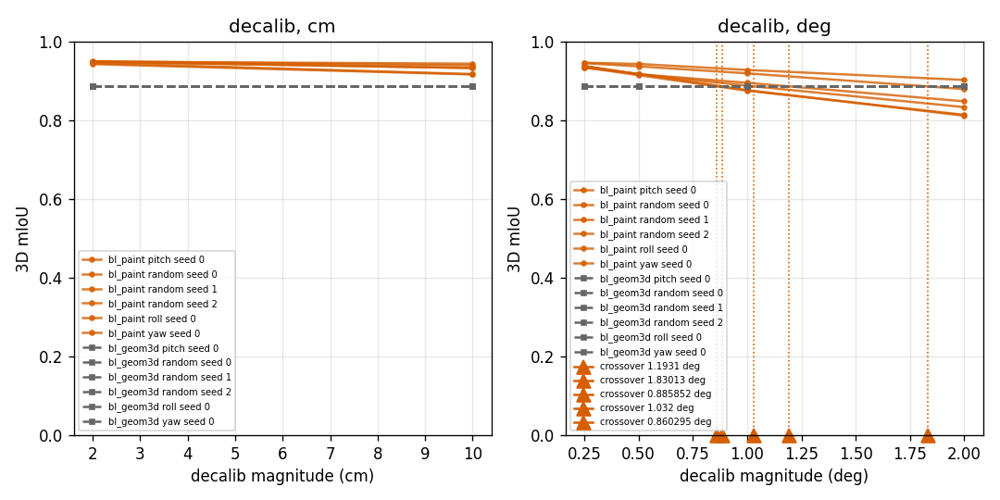
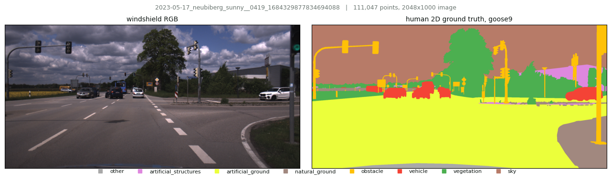

# Eternal SemSeg Challenge

A camera and a 3D lidar look at the same scene. Label every pixel and every
point, using both sensors, and make the two labellings agree.

The agreement clause is the whole problem. It lives entirely in the projection
from lidar frame to image, `pi(p) = K . T_cam_lidar . p`, and that operator is
never exactly right: the calibration drifts, the clocks disagree, and a
spinning lidar samples over a whole revolution so "the cloud at time t" is a
fiction. Get it slightly wrong and image features attach to the wrong points,
the model learns to distrust the camera, and you have paid for a lidar-only
method with extra latency.

So this repo is built around measuring that, not asserting it. The headline
output is not a leaderboard number. It is the **crossover**: the calibration
error at which fusion stops beating lidar alone.

Cross-modal agreement of the two ground truths as the extrinsic rotates away
from truth. No model is involved: both sides are human or generated ground
truth, so every red point is the projection operator being wrong and nothing
else. Agreement falls from 0.984 to 0.830 over two degrees of pitch, and it is
already visibly degraded well before the miscalibration looks like anything to
a person reading the scene.



## The 5-minute path

Requires Docker. Everything else runs inside the image, and nothing is
downloaded.

1. **Get the tools**:
   `docker build -f docker/runtime.Dockerfile -t eternal-semseg-runtime .`
2. **Run everything**: `FIXTURE=/tmp/semseg-fixture ./run_all.sh`
   This builds a synthetic bi-modal scene, runs all four baselines, scores
   them, sweeps the calibration, and writes an HTML report. Zero downloads.
3. **See the problem**:
   `python tools/viewer.py --dataset fixture --root /tmp/semseg-fixture --frame fixture_0000 --out nominal.png`
   then the same command with `--decalib-pitch-deg 2.0`. The fourth panel is
   the argument this whole repo makes.

To run on real data, fetch `goose_2d_val.zip` and `goose_3d_val.zip` from
[GOOSE](https://goose-dataset.de/docs/setup/#download-dataset), about 6 GB, and
point `--dataset goose --root <path>` at the extracted tree. Read
[the honest gap](#the-honest-gap) first.

## Read next

- [`docs/CHALLENGE.md`](docs/CHALLENGE.md): the full problem, the data, the
  submission format, every metric, the sweeps, grading.
- [`docs/SENSORS.md`](docs/SENSORS.md): both rigs, the real intrinsics, the
  frame convention, and exactly which experiments the public release can and
  cannot support.
- [`docs/ONTOLOGY.md`](docs/ONTOLOGY.md): the frozen class mapping, all 64 fine
  classes, and what the mapping costs. This is a first-class artefact, not an
  appendix.
- [`docs/RULES.md`](docs/RULES.md): what is allowed, what has to be reported,
  and what counts as tuning on the test set.

## What is measured, and where the numbers come from

Two data sources, and the split between them is deliberate.

**GOOSE off-road validation**, 961 frames complete in both modalities across 8
sequences, human-labelled per frame in each. GOOSE was chosen over the
alternatives because its 3D labels are independent evidence rather than 2D
labels projected onto points, which is what makes a fusion claim on it
non-circular.

**A synthetic fixture** that renders both modalities from one set of classed
primitives through an exact known extrinsic. Because both come from a single
source of truth, a correctly calibrated point lands on a pixel of its own class
and a decalibrated one does not, and the gap between those is a measurable
signal.

The fixture is not a stand-in for real data. It is the only place the
projection-dependent experiments can run, for a reason worth stating plainly.

### The honest gap

The public GOOSE annotated release ships **no camera-to-lidar extrinsic and no
poses**. This was verified rather than assumed: neither zip contains any
calibration file, and the published TF tree is an `rqt_tf_tree` dump carrying
frame topology and broadcaster rates with zero numeric transforms in it. The
numbers live in the GOOSE-DB ROS bags as `/tf_static`.

Intrinsics *are* published, and are committed here at
[`docs/calib/`](docs/calib/). But they describe a 2048 x 1536 sensor while the
shipped images are 2048 x 1000, so the release is a crop whose vertical offset
is published nowhere, which leaves even the principal point's `cy` ambiguous.

`GooseDataset.extrinsic()` therefore raises, names every path it searched, and
says where the numbers actually are. It does not return a plausible default.
That is a deliberate refusal: a guessed extrinsic makes every projection,
consistency and sweep number a measurement of a fiction that still looks like a
result.

| experiment | real GOOSE | with `--calib` | fixture |
| --- | --- | --- | --- |
| 3D arm | yes | yes | yes |
| 2D arm | yes | yes | yes |
| fused arm | no | yes | yes |
| cross-modal consistency | no | yes | yes |
| decalibration sweep | no | yes | yes |
| time-offset sweep | no | needs poses too | yes |

Every place this repo reports a number says which source it came from.

## What miscalibration looks like

`tools/viewer.py` at the nominal extrinsic, then the same frame two degrees off
in pitch. The fourth panel is the one to read: green where a lidar point's own
3D class matches the 2D class of the pixel it lands on, red where it does not.





Agreement 0.984 becomes 0.830, a loss of 0.154, over a rotation you would
struggle to spot by eye in the image itself. That gap is the whole argument for
sweeping calibration rather than assuming it.

## The crossover

The decalibration sweep, fused arm against the lidar-only arm whose 3D mIoU is
flat at 0.8860 because it never reads the extrinsic:



Yaw crosses at **0.86 degrees**, pitch at **1.19**, roll not within the two
degrees swept, and no translation crosses within 10 cm. On this fixture the
fused arm therefore tolerates roughly 0.9 degrees of yaw error before it is
worse than ignoring the camera. That is the number a production calibration has
to hold, and being able to state it is why the harness exists.

## The real data

One frame of GOOSE off-road validation, the frame the docs and the problem
statement are written around, with its human 2D labels mapped to `goose9`:



Note what is and is not in it. `sky` covers a large share of the image and
appears in exactly zero of the split's 174,891,807 lidar points. `human` does
not appear in this frame at all, and is 1 point in 3,332 across the whole
split. Those two facts shape every metric decision in
[`docs/CHALLENGE.md`](docs/CHALLENGE.md).

### Measured on it

40 frames of that split, no extrinsic supplied, identical frame set across arms:

| arm | 2D mIoU | 3D mIoU | classes in the 3D mean | consistency |
| --- | --- | --- | --- | --- |
| `bl_prior` | 0.0420 over 9 | 0.0338 | 9 of 9 | declined |
| `bl_cam2d` | 0.2834 over 7 | declined | | declined |
| `bl_geom3d` | declined | **0.1902** | 8 of 9 | declined |
| `bl_paint` | refuses to run | | | |

`bl_geom3d` is the arm that still works with no calibration, by design: nothing
in its 3D path reads the extrinsic. Folded to the published 8-class space it is
also 0.1902, and the PTv3 model the dataset authors report scores 0.8096 there.
That gap is the invitation.

Three things in that table are worth more than the numbers.

`bl_cam2d` scores 1.0000 on the fixture and 0.2834 here, which is the empirical
version of a warning this repo could previously only argue for: a perfect
fixture score measures the fixture. Its per-class detail is the real result,
`sky` at 0.7445 and `vegetation` at 0.4481 against `artificial_structures` and
`obstacle` at exactly 0.0000. An appearance-only model learns what colour
separates and learns nothing about the two classes a robot most needs.

And the two 2D means are not over the same classes, because `vehicle` and
`human` are in none of the 40 frames. `bl_prior` predicts them anyway and eats a
0.0 for each; `bl_cam2d` stays silent and they drop out as nan. On the matched
7-class basis chance is 0.0540, so the camera arm's real margin is 5.25x rather
than the 6.7x a careless reading of the table gives.
And the lidar arm scores exactly **0.0000** on `human`, `vehicle` and `other`,
while its 9-class mean reads 0.1902 and its frequency-weighted IoU reads 0.4703.
It learns `vegetation` at 0.5834 and `natural_ground` at 0.4572, the two classes
that dominate the split, and nothing at all about anything rare or small. Every
averaged number here looks respectable while the model cannot see a person.

[`docs/CHALLENGE.md`](docs/CHALLENGE.md) works through all three, including why
the range bins rise with distance and why that is a class-support artefact
rather than a claim about the sensor.

## The design decision that makes the ablation mean anything

The problem statement demands a lidar-only versus camera-only versus fused
comparison. That comparison only measures *fusion* if the three arms share one
classifier and differ **only** in which features they receive. Three different
architectures compared against each other measures architecture.

So all four baselines share one diagonal Gaussian Naive Bayes, about 25 lines
of numpy in `baselines/common/nb.py`, and differ only in their feature vector:

| baseline | features | role |
| --- | --- | --- |
| `bl_prior` | none | chance floor |
| `bl_geom3d` | height over fitted ground plane, PCA verticality and planarity, range, intensity | lidar-only arm |
| `bl_cam2d` | pixel colour, normalised row and column | camera-only arm |
| `bl_paint` | `bl_geom3d`'s features plus painted RGB | fused arm |

Which also means the decalibration sweep measures exactly what it claims: the
RGB features in the fused arm arrive *through* the projection operator being
perturbed.

`bl_prior` is not a joke entry. Without a chance floor no mIoU means anything,
and mIoU on a 9-class problem where one class is 42 percent of the pixels is
precisely the metric that flatters a model which learned nothing.

`bl_paint` is the naive early-fusion floor: if a real fusion architecture does
not clearly beat appending RGB to the point feature vector, the added
complexity is not justified.

## What the scorer reports

Never a bare mean. Every per-class IoU in full, in both modalities, plus:
boundary IoU, 3D IoU stratified by range, the in-frustum versus out-of-frustum
split, expected calibration error, and cross-modal consistency **always
alongside its coverage**.

Three of those exist because of specific ways a headline number lies.

- **Range stratification**, because point density falls off as one over range
  squared. A model that is excellent up close and useless far away and a model
  that is mediocre everywhere report the same 3D mIoU.
- **The frustum split**, because a 360 degree lidar and a forward camera do not
  see the same scene. On a real GOOSE frame, a 90 degree field of view puts at
  most about 23 percent of the sweep in front of the camera. Without this split
  a fusion gain that came entirely from points the camera never saw is
  indistinguishable from a real one.
- **Consistency with its coverage**, because 0.8 consistency computed over a
  fifth of the points and 0.8 over all of them are different claims.

And one number worth knowing before you optimise anything: over the whole
validation split `vegetation` is 61.75 percent of the points and `human` is
0.030 percent, which is 2,057 times rarer. mIoU is an unweighted class mean, so
it gives `human` a ninth of the weight. A method can win on mIoU and be useless
on the only class where an error injures someone.

Classes absent from a split get `nan` and are excluded from the mean, not
scored as zero. That distinction is load-bearing rather than pedantic: `human`
is 1 point in 3,332 across the whole split and absent entirely from many
individual frames, so per-frame means that score it as zero are dominated by an
artefact of the convention rather than by model quality.

Cross-modal consistency needs no ground truth, so it can be computed on
unlabelled robot logs. That is the point of having it.

## Submissions are statistics, not label files

Predictions are label maps and point arrays, gigabytes per method. They go to a
gitignored run directory. What you submit is a single JSON of accumulated
confusion matrices, per range bin and per frustum side, plus ECE bins and the
consistency counts. Every IoU is exactly recoverable from a summed confusion
matrix, so the scored artefact is tens of kilobytes and CI can grade it.

`eval/score.py` has no `--gt` flag, which is the one place this repo diverges
from its sibling. Ground truth is already inside the matrices; that is what
keeps the submission small.

## Layout

```
semseg/types.py                 Frame and Prediction, the contract
semseg/labels.py                the goose9 label space, the 64-to-9 mapping,
                                and fold_sky for the published 8-class view
semseg/projection.py            the projection operator, z-buffer, painting,
                                and the extrinsic perturbation the sweeps use
semseg/deskew.py                per-point motion compensation
semseg/datasets/goose.py        real GOOSE val, discovers its own layout
semseg/datasets/fixture.py      synthetic bi-modal scene, exact extrinsic
baselines/common/nb.py          the one classifier all four arms share
baselines/common/features.py    the feature extractors they differ in
baselines/bl_*/                 the four arms
eval/metrics.py                 pure math, no I/O
eval/io_formats.py              the submission schema and the accumulator
eval/score.py                   the official scorer
eval/sweep.py                   decalibration, time offset, dropout, deskew
eval/report.py                  self-contained HTML report
tools/viewer.py                 makes miscalibration visible
tools/make_problem_statement.py renders the candidate-facing PDF
docker/                         the runtime image submissions run in
run_all.sh                      every tool, end to end, zero downloads
```

## Reference

A PTv3 model trained on GOOSE reports **0.8096** 3D mIoU on the full validation
split, in the folded 8-class space. That figure is published by the dataset
authors in the GOOSE devkit. It is not measured here, and every place this repo
shows it says so.

## License

MIT, see [LICENSE](LICENSE). The GOOSE data is CC BY-SA 4.0 and is not
redistributed here.
